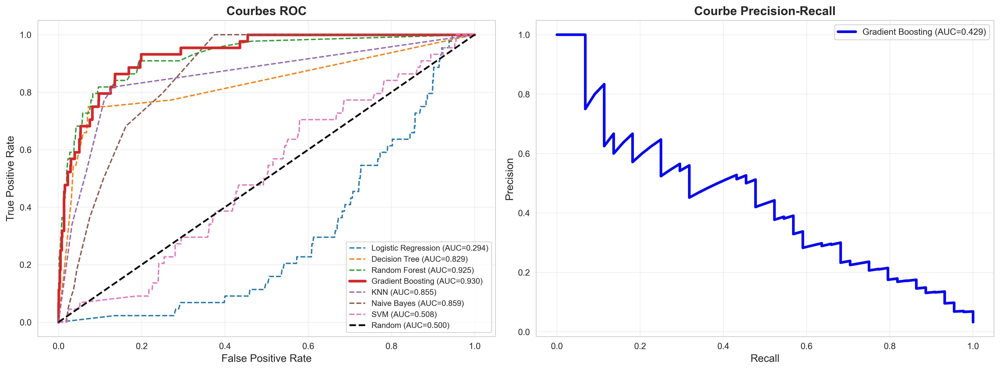

# Détection d'Anomalies Financières (Faillite)

Prédiction de la faillite d'entreprises à partir de données financières — pipeline complet : scraping → traitement → EDA → sélection de features → réduction de dimension → entraînement de modèles → application Streamlit interactive → export PDF.



---

## Table des matières
- [Principales caractéristiques](#principales-caractéristiques)
- [Prérequis & installation](#prérequis--installation)
- [Lancer l'application Streamlit](#lancer-lapplication-streamlit)
- [Notebooks & exploration pas-à-pas](#notebooks--exploration-pas-à-pas)
- [Usage programmatique (exemples)](#usage-programmatique-exemples)
  - [Scraper un CSV](#scraper-un-csv)
  - [Nettoyage & transformation](#nettoyage--transformation)
  - [Fusionner des datasets](#fusionner-des-datasets)
  - [Sélection de features / PCA](#sélection-de-features--pca)
  - [Entraîner un modèle](#entraîner-un-modèle)
  - [Charger le modèle sauvegardé et prédire](#charger-le-modèle-sauvegardé-et-prédire)
  - [Générer un rapport PDF](#générer-un-rapport-pdf)
- [Données et modèles](#données-et-modèles)
- [Structure du projet (brève)](#structure-du-projet-brève)
- [Dépannage rapide](#dépannage-rapide)
- [Contribuer & contact](#contribuer--contact)
- [Crédits](#crédits)

---

## Principales caractéristiques
- Pipeline complet pour la détection de risque de faillite (scraping, nettoyage, équilibrage SMOTE, entraînement).
- Application Streamlit interactive (EDA, transformation, évaluation et prédictions).
- Export de rapports PDF (ReportLab) incluant résumés et visualisations.
- Modèles sauvegardés dans `models/` (ex : `best_model.pkl`, `feature_names.pkl`) et métriques (`models/model_metrics.csv`).

---

## Prérequis & installation

Recommandé : Python 3.10+

Important : la compatibilité des modèles picklés a été testée avec
- numpy == 2.2.6
- scikit-learn == 1.7.2

Installez les dépendances :
```bash
pip install -r requirements.txt
```

Post-installation (Playwright, si vous utilisez le scraping dynamique) :
```bash
playwright install
```

Remarque : si vous avez déjà des versions différentes de numpy / scikit-learn, recréer un virtualenv / venv dédié est recommandé pour assurer la compatibilité avec les modèles pickle fournis.

---

## Lancer l'application Streamlit

Point d'entrée :
```bash
streamlit run app/streamlit_app.py
```

L'interface est prévue pour :
- Visualisation EDA et graphiques
- Prévisualisation et application des transformations
- Entraînement/évaluation sommaire
- Prédictions en temps réel
- Téléchargement d'un rapport PDF d'expertise

URL locale par défaut : http://localhost:8501

---

## Notebooks & exploration pas-à-pas

Les notebooks Jupyter détaillent chaque étape d'analyse :
- `notebooks/01_exploration.ipynb`
- `notebooks/02_cleaning.ipynb`
- `notebooks/03_feature_selection.ipynb`
- `notebooks/04_dimensionality_reduction.ipynb`
- `notebooks/05_modeling.ipynb`

Pour lancer Jupyter :
```bash
jupyter notebook
# ou
jupyter lab
```

---

## Usage programmatique (exemples)

Les modules réutilisables se trouvent dans `processing/`, `analysis/`, `scraping/`, `report/`, `models/`.

1) Scraper un CSV (statique ou depuis GitHub)
```python
from scraping import run_scraping as scraper

# depuis une URL CSV
df = scraper.scrape_from_url("https://example.com/data.csv", dynamic=False)

# depuis GitHub (transforme l'URL automatiquement)
df = scraper.scrape_github_csv("https://github.com/user/repo/blob/main/data.csv")

# validation
valid, msg = scraper.validate_financial_data(df)
print(valid, msg)
```

2) Nettoyage & transformation (prétraitement rapide)
```python
import pandas as pd
from processing.cleaning_and_transform import FinancialPreprocessor

df = pd.read_csv("data/raw/taiwainese Branckucy prediction.csv")
pre = FinancialPreprocessor()
df_clean = pre.fit_transform(df)  # auto-détecte la cible si possible
summary = pre.get_summary(df, df_clean)
print(summary)
```

3) Fusion de datasets
```python
from processing.merge_data import merge_datasets, check_alignment

dfs = [pd.read_csv("data/raw/data1.csv"), pd.read_csv("data/raw/Financial Distress.csv")]
common = check_alignment(dfs[0], dfs[1])
print("colonnes communes:", common)

merged = merge_datasets(dfs, join_type='inner', on=None)  # ou on=common_key si existant
```

4) Sélection de features / PCA
```python
from analysis.feature_selection import FeatureSelector
from analysis.dimensionality_reduction import PCAReducer

selector = FeatureSelector(target_col="Bankrupt?")
df_selected = selector.select_k_best(df_clean, k=20)
print(selector.scores_.head())

pca = PCAReducer(n_components=0.95)
df_pca = pca.fit_transform(df_selected, target_col="Bankrupt?")
pca.plot_explained_variance()
```

5) Entraîner un modèle
```python
from analysis.modeling import ModelTrainer

trainer = ModelTrainer(target_col="Bankrupt?")
X_train, X_test, y_train, y_test = trainer.prepare_data(df_selected, test_size=0.2, use_smote=True)
results = trainer.train_and_evaluate(X_train, X_test, y_train, y_test)
print(results)
# sauvegarder le meilleur modèle
trainer.save_model("models/best_model.pkl", "models/feature_names.pkl")
```

6) Charger le modèle sauvegardé & prédire
```python
import pickle
import pandas as pd

with open("models/best_model.pkl", "rb") as f:
    model = pickle.load(f)

with open("models/feature_names.pkl", "rb") as f:
    features = pickle.load(f)

# Préparer un DataFrame X_new avec les mêmes features (ordre non nécessaire si DataFrame)
X_new = pd.DataFrame([your_row_dict])[features]
pred = model.predict(X_new)
prob = model.predict_proba(X_new)[:,1]
print(pred, prob)
```

7) Générer un rapport PDF depuis l'application ou programmatique
```python
from report.pdf_generator import generate_report, generate_simple_report
from datetime import datetime

# Exemple : history = [{'timestamp': datetime.now(), 'prediction': 0, 'probability': 0.12}, ...]
pdf_bytes = generate_report(predictions_history=history, include_graphs=True, include_details=True)
with open("report_prediction.pdf", "wb") as f:
    f.write(pdf_bytes)
```

---

## Données & modèles (où regarder)
- Données brutes : `data/raw/`
- Données traitées : `data/processed/` (ex : `financial_data_cleaned.csv`, `financial_data_pca.csv`)
- Visualisations générées : `data/figures/` (PNG, HTML interactifs)
- Modèles & artefacts : `models/`
  - `best_model.pkl` : modèle recommandé (Gradient Boosting dans le rapport)
  - `feature_names.pkl` : noms de features utilisés
  - `model_metrics.csv` et `modeling_report.txt` : performances & résumé

Rapport de modélisation synthétique : `models/modeling_report.txt` (ROC-AUC, recall, matrice de confusion, recommandations).

---

## Structure du projet (brève)
- app/ — Streamlit app (app/streamlit_app.py)
- processing/ — nettoyage & fusion (cleaning_and_transform.py, merge_data.py)
- scraping/ — helpers pour télécharger/détecter datasets (run_scraping.py + Playwright helper)
- analysis/ — EDA, sélection de caractéristiques, PCA, modélisation
- report/ — génération de PDFs (pdf_generator.py)
- models/ — modèles et métriques sauvegardés
- data/ — raw / processed / figures
- notebooks/ — notebooks pas-à-pas

---

## Dépannage rapide

- Problème de chargement de pickles (erreur sklearn / numpy) :
  - Assurez-vous d'utiliser numpy 2.2.6 et scikit-learn 1.7.2 (voir requirements).
  - Meilleure pratique : créer un venv propre et installer requirements.txt.

- Playwright / scraping dynamique :
  - Après `pip install playwright`, exécutez `playwright install` pour installer les navigateurs nécessaires.

- Erreurs lors de l'exécution de Streamlit :
  - Vérifiez que `models/best_model.pkl` et `models/feature_names.pkl` existent si l'app tente de charger un modèle au démarrage.
  - Consultez le terminal pour trace d'erreur, et testez les fonctions de base dans une console Python pour isoler le problème.

---

## Contribuer & contact
- Issues et PRs bienvenues — merci d'ouvrir un ticket avant d'entreprendre de gros changements.
- Pour des questions rapides, ouvrez une issue ou contactez le propriétaire du dépôt : FrancKINANI (GitHub : FrancKINANI).

---

## Crédits
- Développé avec Python, scikit-learn, pandas, Streamlit et ReportLab.
- Voir `models/modeling_report.txt` pour le résumé de l'évaluation modèle.

---

Merci d'utiliser / d'explorer ce projet ! Si vous voulez que je vous guide pour reproduire l'entraînement complet dans un notebook ou pour dockeriser l'application, dites-le et je fournis les étapes.